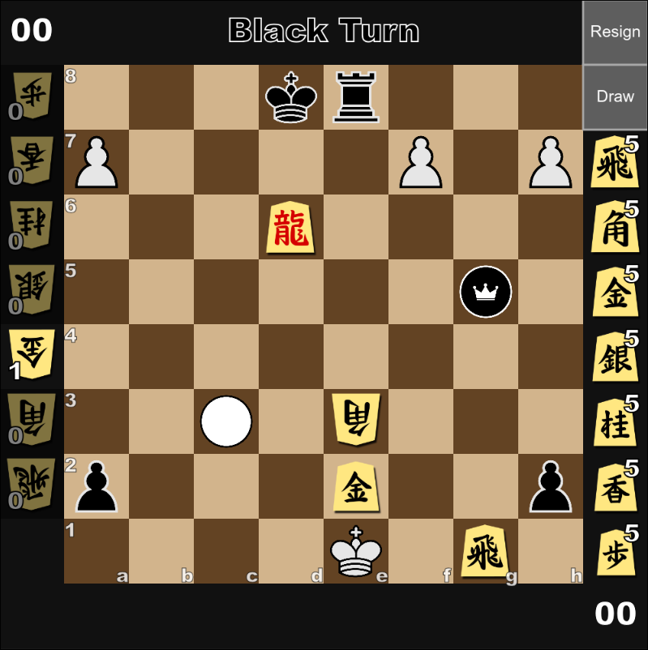

<h1 align="left">CSC (Chess Shogi Checkers)</h1>

<http://kainoagardner.xyz/csc>
     

Multiplayer mix of Chess Shogi and Checkers where players have a budget to buy and place pieces before playing

<h2>Pieces</h2>

#### Chess
> - Pawn
> - Knight
> - Bishop
> - Rook
> - Queen
> - King

#### Shogi
> - Fu 歩兵
> - Kyou 香車
> - Kei 桂馬
> - Gin 銀将
> - Kin 金将
> - Kaku 角行
> - Hi 飛車
> - Ou 王将/玉将

> - Tokin と金
> - NariKyou 成香
> - NariKei 成桂
> - NariGin 成銀
> - Uma 竜馬
> - Ryuu 竜王

#### Checkers
> - Checker
> - Checker King

<h2>Set up game Rules</h3>

<h3>Buy pieces from the shop to set up your side of the board.</h3>

<h3>Battle the opponent until a winner emerges.</h3>

<h2>Game logs and Replays</h2>

